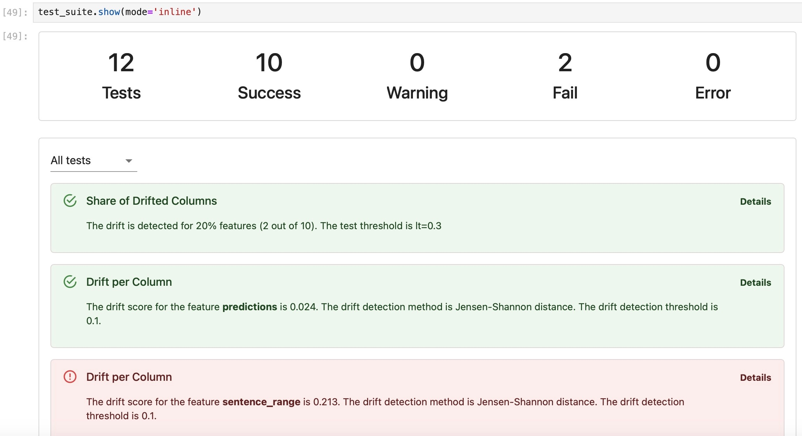
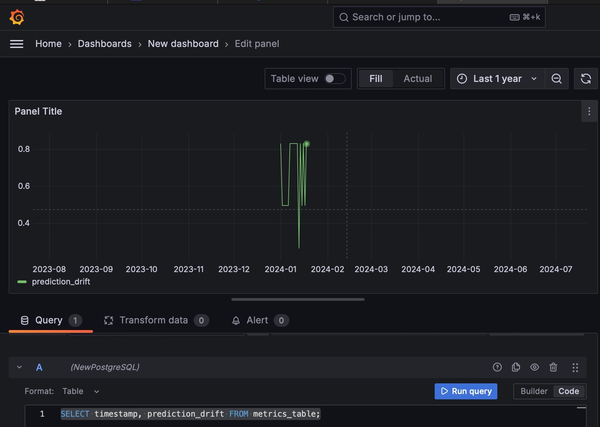
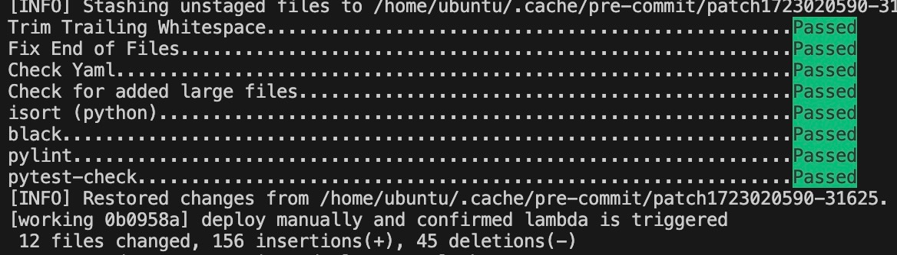
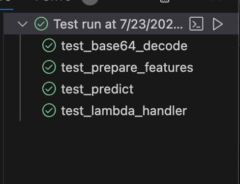
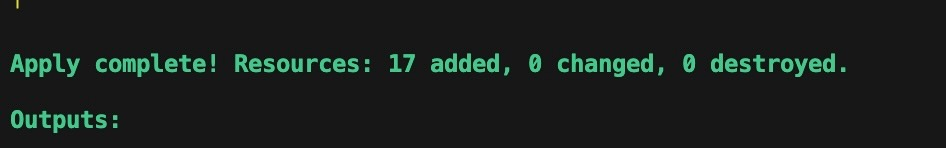

# Mental Health Project: Stress Prediction Using Multimodal Inputs
## Introduction
This is a final project for the Data Talks Club MLOps [Zoomcamp ](https://github.com/DataTalksClub/mlops-zoomcamp). In this project, I have implemented the end-to-end machine learning life cycle, including infrastructure provisioning using Terraform, modeling and experiment tracking using MLflow, orchestration with Mage, deployment using Flask, Lambda and Kinesis, monitoring with Evidently and Grafana, and best practices such as integration tests with Localstark, unit testing, linting and formatting, Makefile and pre-commit hooks.


## Table of Contents
- [Problem Statement](#problem-statement)
- [Data](#data)
- [Experiment Tracking](#experiment-tracking)
- [Orchestration](#orchestration)
- [Deployment](#deployment)
- [Monitoring](#monitoring)
- [Best Practices](#best-practices)
- [General Guidelines](#general-guidelines)
- [Future Works](#future-works)
- [Setup](#setup)
- [Acknowledgement](#acknowledgement)
- [References](#references)

### Problem Statement
The World Health Organization (WHO) defines mental health as a state of well-being that allows individuals to effectively manage the stresses of life, fulfill their potential, learn efficiently, work productively, and contribute meaningfully to their communities. This definition highlights the critical role that stress management plays in maintaining mental health. When stress becomes unmanageable, it can act as a significant trigger for mental health issues, leading to a range of emotional and psychological difficulties. In contrast to the WHO definition, the National Alliance on Mental Illness (NAMI) describes mental illness as a set of conditions that profoundly impact a person's emotions, behavior, thoughts, and mood, resulting in disruptions to their daily functioning [1]. The effects of mental illnesses are far-reaching, affecting over 1 billion people globally and leading to substantial economic consequences[2]. Among the various factors contributing to mental illness, stress was recognized as a key element [3], highlighting the urgent need for technological tools that enable continuous monitoring and care to detect stress and prevent mental health issues.

In today's digital age, the integration of technology into mental health care is becoming increasingly important. One emerging area of interest is the use of social media as a data source for predicting and monitoring mental health conditions. Social media platforms, where users frequently express their thoughts, emotions, and experiences, offer a wealth of information that can be harnessed for mental health monitoring. This project aims to leverage this data by predicting stress levels based on a combination of social media posts (text) and numerical data from linguistic analysis. The data for this project is sourced from publicly available datasets on Kaggle. By applying traditional machine learning models and crafting features with a feature vectorizer, this project explores how effectively these methods can predict stress. Given the high dimensionality of the tabular data, mutual information (MI) was used to identify the top five numerical features with the highest MI values. These features were selected to optimize the model's performance while balancing computational efficiency.

Moreover, the project not only focuses on the technical aspects of stress prediction but also considers the broader implications for mental health monitoring. By accurately predicting stress levels using a multimodal approach—combining textual and numerical data—this project contributes to the growing field of digital mental health. The use of mutual information for feature selection exemplifies the careful consideration given to feature relevance and model performance. The project's exploration of both the challenges and opportunities presented by high-dimensional data reflects a commitment to advancing our understanding of how technology can be used to support mental well-being. As mental health continues to be a global priority, projects like this demonstrate the potential for innovative solutions that integrate machine learning, data science, and mental health care to address the complex challenges of stress and mental illness in today's world.

Please note that all setup instructions can be found in the [Setup](#setup) section.

### Data
The dataset is publicly available online on [Kaggle](https://www.kaggle.com/datasets/ruchi798/stress-analysis-in-social-media). The training dataset information, as analysed on Mage and a table of the selected features are presented below:

<div align="center">
  
</div>
<!--  -->

The training dataset has 2838 rows. The test dataset (which is not shown here), has 715 rows. Both datasets have 116 columns, however only 6 columns in total were selected (i.e. the text column and 5 numerical features)

The final selected features which were used to train the model and make inference are:
|      Text         | lex_liwc_Tone  |   lex_liwc_i   |lex_liwc_negemo | lex_liwc_Clout | Sentiment|
|-------------------|----------------|----------------|----------------|----------------|----------|
| Social media posts|    float       |     float      |      float     |     float      |  float   |

The lables in the dataset are 1: stressed and 0:unstressed. As shown below, the dataset is slightly imbalance. However, this is very minimal with about 51-49% distribution between stressed and unstressed labels.


### Experiment tracking
I explored using an EC2 instance as a tracking server for MLflow. This is to model a situation whereby there are different machine learning professionals in a company, who can easily view experiements run on MLflow through the tracking server's public IP address. The model artificacts were also stored and can be retrieved from S3.

The notebooks used for experiment tracking can be found in [model-experiments](model-experiments/experiment_tracking) directory. There are two notebooks namely `stress_prediction_mlflow.ipynb` and `stress_prediction_hyperparameter.ipynb`. The former was used to explore different models and the Random Forest(RF) was shown to have the best performance. I also explored the use of stacked features (text and numerical data), and only text data, and it was discovered that the RF model performed better using the stacked features (denoted as combined in the plot below). The stacked features and RF were then used for hyperparameter tuning, to get the best parameters. The model and vectorizer artifacts were then logged for the best performing model. Note that hyperopt was used for the hyperparameter tuning. Since this minimizes a loss, and we intend to maximise the accuracy, a negative accuracy was returned as the objective to be minimized.

The best performing model was then saved in the model registry. Although this was done programmitically, it can also be done in the MLflow UI.

Please not that for the experiment tracking, this was done outside orchestration. However, using Mage, I was able to load my model performance from MLflow. The plot of the model performances can be found as follows.


### Orchestration
I created two pipelines: one for data preparation and another for the modeling. Each pipeline had blocks of data loaders, transformers and data exporters. Specifically, for the data preparation pipeline, I had a data loader block to ingest the data. Then I had a transformer block to transform the data(preprocess text data and standardize the numerical features). Splitting the data into training and validation set was also done in the transformer block. Thereafter, there was a data exporter block to prepare the features.

<!--  -->
<div align="center">
  
</div>


The data exporter block also had some unit tests to test for the shape of the features to ensure feature size consistency between training and validation data. I created utility Python scripts for preprocessing, splitting data, feature transformation and encoding features.

Global Data Product (GDP) was created in Mage to use results from my data preparation pipeline in my modeling pipeline. This avoids redundancy of having to compute the results again everytime the pipeline runs. The results of the build data exporter(in data preparation pipeline) was used in this regard.

The modeling pipeline also has a transformer block for hyperparameter tuning, and a data exporter block to build the model and return the model and vectorizer (from text data). As seen from the image, I had an extra “check” block which was used for debugging my utility scripts.

<!--  -->
<div align="center">
  
</div>

Note that although experimentation and hyperparameter tuning weere done on Mage, these were not logged into Mlflow. Nevertheless, the already logged models were loaded in Mage and visualized.

### Deployment

For model deployment, I explored all the deployment modes covered in the course, including batch and online deployment (which encompasses both web service and streaming deployment).

Given that my project focuses on predicting stress using multimodal data from social media posts and various tabular features, online deployment emerged as the most relevant approach as we want to predict stress as soon as it is possible. Specifically, the real-time nature of social media data makes online prediction critical for timely and accurate stress detection. Batch deployment, on the other hand, is more suitable for scenarios where predictions can be aggregated and processed at intervals, such as churn prediction or recommendation systems. Despite this, I still explored batch deployment to gain familiarity with the process and ensure I understood the strengths and limitations of each approach.

In my online deployment exploration, I worked with both web service and streaming approaches. For web service deployment, I used Flask as the lightweight web framework and Gunicorn as the WSGI HTTP server to serve the model as a production server. This setup allowed me to create a robust and scalable API endpoint for real-time stress prediction. For streaming deployment, I utilized AWS Lambda for serverless computing and Amazon Kinesis for real-time data streaming. These tools enabled me to handle continuous data flows effectively, processing social media posts in near real-time to predict stress levels.

To streamline the deployment process and ensure consistency across environments, I packaged both the web service and streaming deployments into Docker containers. Docker's containerization technology made it easy to spin up and manage these deployments in a controlled and reproducible manner. The containerized approach also simplified the process of loading model artifacts directly from S3, ensuring that the most up-to-date models were always used in production.

One insight I gained during this process was the value of utility scripts for handling recurring operations, such as data preprocessing and model loading. While I didn't include these utility scripts in my final deployment modules, I recognize that they could enhance the efficiency and maintainability of the deployment process in a real-world setting.

For environment management, I chose pipenv, which provided a reliable way to manage dependencies and maintain a consistent development environment across different stages of the project. The combination of Flask, Gunicorn, AWS Lambda, Kinesis, and Docker proved to be a powerful toolkit for deploying machine learning models in various online scenarios.

Overall, I thoroughly enjoyed experimenting with these tools and gained a deep appreciation for the complexities and possibilities of deploying machine learning models in real-world environments.

### Monitoring
During the machine learning lifecycle, it is common for machine learning models to degrade over time due to phenomena such as data drift or concept drift. Data drift occurs when the statistical properties of the input data change, while concept drift refers to changes in the underlying relationship between the input data and the target variable. These issues can lead to a decline in model performance, making it essential to continuously monitor both the models and the data they process during inference.

To monitor my machine learning models effectively, I leveraged Evidently, a powerful open-source tool designed specifically for monitoring and analyzing machine learning models. Evidently allowed me to track the performance of my models over time and detect any signs of drift or anomalies in the data.

In my project, I utilized the validation data used during the model evaluation phase as the reference data. This reference dataset served as a benchmark against which I compared the data encountered during inference (the test data). By using the test data as the current data, I was able to monitor the model’s performance on real-world inputs, ensuring that any deviations from the reference were promptly identified.

Given that my project involves multimodal inputs, including both social media posts (text data) and numerical data, I ensured that my monitoring approach was comprehensive. I included both numerical and text features in my column mapping, which allowed Evidently to analyze a wide range of metrics related to data quality and model performance. Specifically, I generated reports on various metrics such as column and data drift, missing values, and text drift. These reports provided valuable insights into how well the model was adapting to new data and highlighted any potential issues that could impact its performance.


To visualize and explore these metrics, I created an interactive dashboard using the Evidently UI. This dashboard allowed me to monitor the model’s behavior in real-time, providing a clear and intuitive way to track key performance indicators. Additionally, I used Evidently’s test suite to debug the data, ensuring that the model was making accurate predictions and identifying any potential sources of error. An image of the dashboard is shown below, where you can see the detailed metrics and insights that were captured.


Data debugging using test suite:



But monitoring doesn’t stop at visualizations. To take my monitoring approach a step further, I extracted key variables such as prediction drift (i.e., the drift between predictions made during inference and those made during validation), the number of drifted columns, and out-of-vocabulary drift scores, among others. These metrics were crucial for understanding how the model’s predictions were evolving over time and identifying any factors that could lead to a decline in accuracy.

To make these insights actionable, I logged these variables into a database using a custom Python script. This allowed me to systematically track changes over time and provided a historical record of model performance. With the data logged, I imported the table as a data source into Grafana, a popular open-source analytics and monitoring platform. Using Grafana, I was able to create time series plots of the metrics, providing a powerful tool for visualizing trends and detecting anomalies in the model’s behavior over time.




Please note that a hypothetical date was chosen for the setup. When the image for Adminer was captured, the initial start time selected was July 2024, which corresponded to the month and date when the plots were generated. However, since this setup logs data into the future and Grafana was unable to display future data, the start date was later adjusted to January 2024 to ensure that the plots could be viewed in Grafana. This is the reason for the discrepancies in date between the two images.

It should also be noted that I explored batch backfilling for model logs, which involves retrospectively logging metrics for previous time periods. Hypothetically, I logged these metrics on a daily basis, which would allow for continuous monitoring in a production environment. This approach ensures that any issues with the model can be identified and addressed promptly, minimizing the risk of model degradation.

In summary, my approach to monitoring in this MLOps project involved a combination of Evidently for generating and visualizing detailed metrics, and Grafana for creating insightful time series plots. This comprehensive monitoring setup ensures that the model remains reliable and performs well even as the data evolves, providing a solid foundation for maintaining high-quality machine learning models in production.

### Best Practices
To follow MLOps best practices, I implemented the following:
 - [x] Unit tests using Pytest.
 - [x] Integration test using Localstark.
 - [x] Linter and code formatter using pylint, isort and black.
 - [x] Makefile to automate building and managing dependencies.
 - [x] pre-commit hooks to enforce code quality standards and prevent bad code from being committed.

Outputs from the pre-commit hook is shown below:
<!--  -->
<div align="center">
  
</div>
The unit tests checks for the base64 encoding, features, predict function, lambda function. These could be tested from the command line, but also visible in VS code (my code editor) as shown belown.
<!--  -->
<div align="center">
  
</div>

### General Guidelines
- After spinning up a docker container, you can run `docker ps` to check information about running containers
- You can work with conda environment for development, but it's easier to use `pip environment` for containerization. If you want to maintain the environment using conda, you will need a `requirements.txt` file to pip install in your Dockerfile.
- Please note that due to time constraint, as at the time of submitting this project for review, the orchesration folder was excluded from the pre-commit hook manually by resetting the git cache of the orchestration folder.
This can be done by
```bash
git reset orchestration
```
- Please note that the tracking server changes from time to time based on the current running public IP address of the EC2 instance.
- In Mage, a new block cannot be created when another block is running
- To debug the charts in Mage, you might need to create a block that runs your custom code. The "check" block in my mental health pipeline was created for this reason.

### Future Works
- Creation of alerts and triggers for retraining in orchestration.
- Logging of models to MLflow with orchestration pipeline.
- Store and load the data from S3.
- Incorporation of the utils function into the deployment Python modules. However, these were left in this implementation to show different methods of loading the model and vectorizer artifacts i.e. directly from S3 like in deployment scripts, and locally (after retrieval from S3) as in the [model_loader.py](utils/model_loader.py).
- Setting up alerts from Grafana for automatic retraining.
- Poetry for managing dependencies
- Making utils to load data from S3 instead of having to download it locally from S3 first before loading. Nevertheless, the [run.sh](tests/integration-tests/run.sh) scripts retrieves the data from S3 and downloads locally.
- Optimizing code to facilitate lower cloud costs.
- Streaming data from social media platforms directly and using Big Data tools such as Apache Kafka.
- Implement CI/CD pipelines to enable frequent, reliable, and automated delivery of code changes
- More synergy between all components. My methodology of going from week 1 module to week 6, caused that there were some modules that were sort of disconnected e.g there was no experiment logging to MLflow during orchestration as this was previously done in a previous step and would be redundant.

### Setup
After cloning the directory, the first thing to do is to set Python path for the folder as a variable. This makes it possible to use the folder as a Python module.
```bash
export PYTHONPATH=$PYTHONPATH:~/mental_health_mlops_project
```

To setup the infrastructure using Terraform, follow the instructions here: [infrastructure](infrastructure/README.md). Note that you will need terraform in your environment and also configure your AWS credentials. The S3 bucket used to store the model artifacts are created independent of IaC because we do not want this bucket destroyed when we destroy other infrastructure created by Terraform. It might be helpful to provision the resources last, when you are ready for deployment.

After provisioning, 17 resources will be created as shown below



To run the model experiments, follow the instructions for model training [training](model-experiments/training/README.md).

Intructions on how to set up environment for experiment tracking can be found [experiment tracking](model-experiments/experiment_tracking/README.md)

Orchestration instructions can be found here: [orchestration](orchestration/README.md).

For instructions on reimplementing the deployment aspect of this project, go here: [deployment](deployment/README.md)

Monitoring instructions can be found here: [monitoring](monitoring/README.md).

To implement the unit tests and integration tests, check [tests](tests/README.md)

Other setup instructions such as connecting to EC2, setting up linter and formater, makefile etc, check here: [other setup instructions](setup.md)

### Acknowledgement
I would like to appreciate the Data Talks Club team for putting together a very valuable introduction to MLOps. This got me started and I am very excited about everything I have learnt and using my skills in offering machine learning services in the industry.

I would also like to appreciate the dataset contributors for making their dataset publicly available. I would also like to appreciate Kaggle contributors that have previously worked on this project, providing insights to get me started, especially considering my time constraint. I was able to improve on this by exploring feature selection using mutual information and including a stacked combination of the social media posts and the numerical features for stress prediction.

Finally, I would like to appreciate all the participants of the 2024 MLOps Zoomcamp cohort. Thank you for your unwavering support, guidance, and encouragement which kept me going in spite of the numerous bugs and challenges I faced.

### References

[1]	E. H. Rosado-Solomon, J. Koopmann, W. Lee, and M. A. Cronin, “Mental Health and Mental Illness in Organizations: A Review, Comparison, and Extension,” Acad. Manag. Ann., vol. 17, no. 2, pp. 751–797, Jul. 2023, doi: 10.5465/annals.2021.0211.

[2]	J. Blair, J. Brozena, M. Matthews, T. Richardson, and S. Abdullah, “Financial technologies (FinTech) for mental health: The potential of objective financial data to better understand the relationships between financial behavior and mental health,” Front. Psychiatry, vol. 13, 2022, Accessed: Jan. 08, 2024. [Online]. Available: https://www.frontiersin.org/articles/10.3389/fpsyt.2022.810057

[3]	Y.-C. Shin, D. Lee, J. Seol, and S.-W. Lim, “What Kind of Stress Is Associated with Depression, Anxiety and Suicidal Ideation in Korean Employees?,” J. Korean Med. Sci., vol. 32, no. 5, pp. 843–849, May 2017, doi: 10.3346/jkms.2017.32.5.843.
